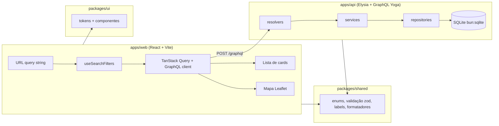

# Arquitetura

> System design do clone da busca de imóveis à venda. Leia junto com
> [business-rules.md](business-rules.md) (o *quê*) — este documento é o *como*.
> Itens marcados **(planejado)** ainda não existem no código; ao implementá-los, remova a marca
> e atualize o que tiver mudado.

## 1. Visão geral



| Pacote | Responsabilidade | Pode importar |
|---|---|---|
| `packages/shared` | Enums, tipos de domínio, schemas **zod** de validação, labels pt-BR, formatadores (`formatBRL`, plurais), geração de títulos, regras de badge. Código puro, sem I/O. | nada do monorepo |
| `packages/ui` | Design system: tokens (CSS variables) e componentes React sem conhecimento de rede. Componentes de domínio recebem dados prontos por props. | `shared` |
| `apps/api` | Servidor HTTP/GraphQL, acesso a dados, seed. | `shared` |
| `apps/web` | Páginas, roteamento, estado de URL, chamadas GraphQL, composição de componentes do `ui`. | `shared`, `ui` |

Regra: dependências só fluem nessa direção. `ui` nunca chama a API; `api` nunca importa `ui`/`web`.

## 2. Estrutura de pastas (planejada)

```
apps/
  api/
    src/
      index.ts                  # bootstrap Elysia + plugin graphql-yoga
      context.ts                # monta o contexto por request (db, userId, loaders)
      graphql/
        schema/*.graphql        # SDL — fonte da verdade do contrato
        scalars.ts
        errors.ts               # helpers de erro (INVALID_FILTER, NOT_FOUND…)
      modules/
        properties/
          properties.resolvers.ts
          properties.service.ts
          properties.repository.ts
          property-where.ts     # ÚNICO lugar que traduz filtros → SQL
          map-clusters.ts
          *.test.ts
        neighborhoods/ …
        favorites/ …
        locations/ …            # autocomplete
      db/
        client.ts               # abre o SQLite (WAL, foreign_keys=ON)
        migrate.ts
        migrations/0001_init.sql …
        seed/                   # gerador determinístico (seed fixa)
    data/app.db                 # gerado; fora do git
  web/
    src/
      main.tsx, router.tsx
      graphql/                  # documentos .graphql + código gerado (codegen)
      features/
        search/                 # página de busca: hooks, componentes de página
        property-detail/
        favorites/
      lib/                      # cliente GraphQL, userId anônimo, utilidades
packages/
  shared/src/
    domain/                     # enums, tipos, amenities, labels
    validation/                 # schemas zod (filtros, cadastro)
    format/                     # formatBRL, plurais, títulos, datas relativas
    search/                     # serialização filtros ⇄ URL, defaults
  ui/src/
    tokens/                     # tokens.css + tokens.ts
    components/                 # Button, Chip, Checkbox, RangeField, Modal…
    domain/                     # PropertyCard, PriceTag, FilterBar, MapCluster…
    **/*.stories.tsx
docs/
```

## 3. Fluxo de uma busca (ponta a ponta)

1. **URL** `/comprar/imovel/pinheiros?tipos=apartamento&quartos=3&ordem=menor-preco`
   (contrato completo no §8).
2. `useSearchFilters()` (web) faz `parseSearchParams()` de `packages/shared/search` →
   objeto `SearchFilters` tipado + `sort`. Alterar um filtro chama `serializeSearchParams()`
   e faz `navigate` (push para mudanças do usuário, replace para movimentos do mapa).
3. Duas queries TanStack Query em paralelo, com `queryKey` derivada dos filtros:
   - `searchProperties` (lista + `totalCount`, infinita via cursor);
   - `propertyMapClusters` (bbox + zoom atuais do mapa).
   O painel "Mais filtros" usa `searchProperties(first: 0) { totalCount }` com os filtros
   em rascunho para o botão "Ver N imóveis" (debounce 300 ms).
4. **Resolver** recebe os args já tipados pelo schema GraphQL e repassa ao serviço.
5. **Service** valida com o schema zod de `shared` (`searchFiltersSchema`) — faixas, min≤max,
   bbox — e converte falhas em `GraphQLError` `BAD_USER_INPUT`/`INVALID_FILTER`. Resolve
   `onlyFavorites` com o `userId` do contexto. Aplica defaults (`sort = RELEVANCE`,
   `first = 24`).
6. **Repository** monta SQL com `buildPropertyWhere(filters)` → `{ sql, params }` (o mesmo
   WHERE é usado pela lista, pela contagem e pelos clusters) e executa statements preparados
   e cacheados do `bun:sqlite`.
7. Campos relacionados (fotos, bairro, `isFavorite`) são resolvidos em lote por loaders
   por request (padrão DataLoader) — nunca N+1.
8. Resposta volta como `PropertyConnection`; o web renderiza `PropertyCard`s do `ui`.

## 4. Schema GraphQL (planejado)

Schema-first: o SDL em `apps/api/src/graphql/schema/` é a fonte da verdade; tipos de
resolvers (api) e de operações (web) são gerados por **GraphQL Code Generator**
(`bun run codegen`). Enums GraphQL espelham os de `packages/shared` (um teste garante que
batem).

```graphql
scalar DateTime

enum PropertyType { APARTMENT HOUSE CONDO_HOUSE STUDIO }
enum PropertyStatus { DRAFT ACTIVE INACTIVE }
enum SortOrder { RELEVANCE NEWEST PRICE_ASC PRICE_DESC PRICE_PER_M2_ASC }
enum PublishedWithin { TODAY LAST_7_DAYS LAST_15_DAYS LAST_30_DAYS LAST_2_MONTHS LAST_6_MONTHS }
enum PropertyBadge { EXCLUSIVE PRICE_DROP GREAT_PRICE NEW_LISTING RENTED }
enum AmenityCategory { CONDOMINIUM FEATURES FURNITURE WELLBEING APPLIANCES ROOMS ACCESSIBILITY }
enum AmenityCode { GYM GREEN_AREA TOY_LIBRARY # … lista completa em business-rules.md §3
}

input IntRange { min: Int, max: Int }
input BoundingBox { north: Float!, south: Float!, east: Float!, west: Float! }

input PropertySearchFilters {
  neighborhoodSlugs: [String!]
  bbox: BoundingBox
  types: [PropertyType!]
  price: IntRange
  monthlyCost: IntRange
  area: IntRange
  minBedrooms: Int
  minBathrooms: Int
  minSuites: Int
  minParkingSpaces: Int
  publishedWithin: PublishedWithin
  furnished: Boolean
  nearSubway: Boolean
  exclusive: Boolean
  rented: Boolean
  amenities: [AmenityCode!]
  onlyFavorites: Boolean
}

type Neighborhood {
  id: ID!
  slug: String!
  name: String!
  zone: String!
  center: LatLng!
  bounds: Bounds!
  medianPricePerM2: Int!
}

type LatLng { lat: Float!, lng: Float! }
type Bounds { north: Float!, south: Float!, east: Float!, west: Float! }

type Amenity { code: AmenityCode!, label: String!, category: AmenityCategory! }

type Photo { url: String!, position: Int! }

type Property {
  id: ID!                      # = código público
  status: PropertyStatus!
  type: PropertyType!
  title: String!               # derivado (business-rules §6.3)
  headline: String!
  street: String!              # número/complemento nunca expostos
  neighborhood: Neighborhood!
  location: LatLng!
  salePrice: Int!
  previousPrice: Int
  condoFee: Int!
  iptu: Int!
  monthlyCost: Int!
  pricePerM2: Int!
  area: Int!
  bedrooms: Int!
  suites: Int!
  bathrooms: Int!
  parkingSpaces: Int!
  floor: Int
  isFurnished: Boolean!
  acceptsPets: Boolean!
  nearSubway: Boolean!
  isExclusive: Boolean!
  isRented: Boolean!
  description: String!
  amenities: [Amenity!]!
  unavailableAmenities: [Amenity!]!   # aplicáveis ao tipo e ausentes
  photos(limit: Int): [Photo!]!
  photoCount: Int!
  badges: [PropertyBadge!]!
  isFavorite: Boolean!                # false sem userId
  publishedAt: DateTime
}

type PageInfo { endCursor: String, hasNextPage: Boolean! }
type PropertyConnection { nodes: [Property!]!, totalCount: Int!, pageInfo: PageInfo! }

type MapCluster {
  id: ID!            # "z{zoom}:{row}:{col}" — estável entre pans
  center: LatLng!    # média das posições
  count: Int!
  bounds: Bounds!    # extensão real dos pontos (zoom ao clicar)
  propertyId: ID     # preenchido quando count = 1
}
type MapClusterResult { clusters: [MapCluster!]!, totalCount: Int! }

enum LocationSuggestionKind { NEIGHBORHOOD STREET PROPERTY_CODE }
type LocationSuggestion {
  kind: LocationSuggestionKind!
  label: String!         # "Pinheiros, São Paulo – SP"
  neighborhoodSlug: String
  propertyId: ID
  center: LatLng!
  bounds: Bounds
}

type Query {
  searchProperties(
    filters: PropertySearchFilters
    sort: SortOrder = RELEVANCE
    first: Int = 24          # 0…48 (0 = só contagem)
    after: String
  ): PropertyConnection!
  propertyMapClusters(filters: PropertySearchFilters, bbox: BoundingBox!, zoom: Int!): MapClusterResult!
  property(id: ID!): Property                 # null se não existir; INACTIVE/DRAFT também retornam null para o público
  locationSuggestions(query: String!, limit: Int = 8): [LocationSuggestion!]!   # query ≥ 2 caracteres
  neighborhoods: [Neighborhood!]!
  amenities: [Amenity!]!
}

type Mutation {
  addFavorite(propertyId: ID!): Property!
  removeFavorite(propertyId: ID!): Property!
}
```

Convenções do schema:
- Nomes em inglês, camelCase; enums UPPER_SNAKE; labels pt-BR vêm de `shared`, não do schema
  (exceto `Amenity.label` e `LocationSuggestion.label`, por conveniência).
- Mutations futuras seguem `verbNoun(input: VerbNounInput!): VerbNounPayload!` (ex.:
  `createProperty(input: CreatePropertyInput!)`). As duas de favoritos são exceção histórica.
- Erros: `GraphQLError` com `extensions.code` ∈ `BAD_USER_INPUT` (+ `extensions.field`),
  `NOT_FOUND`, `UNAUTHENTICATED`, `INTERNAL`. Mensagens em pt-BR.
- Identidade: header `x-user-id` (UUID anônimo do navegador) lido em `context.ts`.

## 5. Modelo de dados (SQLite)

Configuração: `PRAGMA journal_mode = WAL; foreign_keys = ON; synchronous = NORMAL`.
Timestamps em **INTEGER (epoch ms, UTC)**; booleanos em INTEGER 0/1; dinheiro em INTEGER reais.
Migrações são arquivos SQL numerados em `apps/api/src/db/migrations`, aplicados em ordem e
registrados em `schema_migrations`.

```sql
CREATE TABLE neighborhoods (
  id INTEGER PRIMARY KEY,
  slug TEXT NOT NULL UNIQUE,
  name TEXT NOT NULL,
  name_normalized TEXT NOT NULL,          -- minúsculo, sem acento (autocomplete)
  zone TEXT NOT NULL,
  center_lat REAL NOT NULL, center_lng REAL NOT NULL,
  north REAL NOT NULL, south REAL NOT NULL, east REAL NOT NULL, west REAL NOT NULL,
  median_price_per_m2 INTEGER NOT NULL DEFAULT 0
);

CREATE TABLE properties (
  id INTEGER PRIMARY KEY,                 -- começa em 1000000
  status TEXT NOT NULL CHECK (status IN ('DRAFT','ACTIVE','INACTIVE')),
  type TEXT NOT NULL CHECK (type IN ('APARTMENT','HOUSE','CONDO_HOUSE','STUDIO')),
  cep TEXT NOT NULL,
  street TEXT NOT NULL,
  street_normalized TEXT NOT NULL,
  number TEXT NOT NULL,
  complement TEXT,
  neighborhood_id INTEGER NOT NULL REFERENCES neighborhoods(id),
  lat REAL NOT NULL, lng REAL NOT NULL,
  sale_price INTEGER NOT NULL,
  previous_price INTEGER,
  condo_fee INTEGER NOT NULL,
  iptu INTEGER NOT NULL,
  monthly_cost INTEGER GENERATED ALWAYS AS (condo_fee + iptu) STORED,
  price_per_m2 INTEGER GENERATED ALWAYS AS (sale_price / area) STORED,
  area INTEGER NOT NULL,
  bedrooms INTEGER NOT NULL, suites INTEGER NOT NULL,
  bathrooms INTEGER NOT NULL, parking_spaces INTEGER NOT NULL,
  floor INTEGER,
  is_furnished INTEGER NOT NULL DEFAULT 0,
  accepts_pets INTEGER NOT NULL DEFAULT 0,
  near_subway INTEGER NOT NULL DEFAULT 0,
  is_exclusive INTEGER NOT NULL DEFAULT 0,
  is_rented INTEGER NOT NULL DEFAULT 0,
  description TEXT NOT NULL,
  photo_count INTEGER NOT NULL DEFAULT 0, -- desnormalizado (card e score)
  relevance_score REAL NOT NULL DEFAULT 0,
  published_at INTEGER,
  created_at INTEGER NOT NULL,
  updated_at INTEGER NOT NULL
);

CREATE TABLE property_photos (
  property_id INTEGER NOT NULL REFERENCES properties(id) ON DELETE CASCADE,
  position INTEGER NOT NULL,
  url TEXT NOT NULL,
  PRIMARY KEY (property_id, position)
) WITHOUT ROWID;

CREATE TABLE property_amenities (
  property_id INTEGER NOT NULL REFERENCES properties(id) ON DELETE CASCADE,
  amenity_code TEXT NOT NULL,
  PRIMARY KEY (property_id, amenity_code)
) WITHOUT ROWID;

CREATE TABLE favorites (
  user_id TEXT NOT NULL,
  property_id INTEGER NOT NULL REFERENCES properties(id) ON DELETE CASCADE,
  created_at INTEGER NOT NULL,
  PRIMARY KEY (user_id, property_id)
) WITHOUT ROWID;
```

Validações de faixa ficam em `shared` (zod), não em `CHECK` — o banco só garante enums e
integridade referencial. Comodidades são texto (código do enum) para manter o banco legível e
dispensar tabela de catálogo; o catálogo vive em `shared/domain/amenities.ts`.

### 5.1 Índices

```sql
-- ordenações (keyset): status primeiro porque toda busca filtra ACTIVE
CREATE INDEX idx_prop_relevance ON properties(status, relevance_score DESC, id DESC);
CREATE INDEX idx_prop_newest    ON properties(status, published_at DESC, id DESC);
CREATE INDEX idx_prop_price     ON properties(status, sale_price, id);
CREATE INDEX idx_prop_ppm2      ON properties(status, price_per_m2, id);
-- localização
CREATE INDEX idx_prop_geo       ON properties(status, lat, lng);
CREATE INDEX idx_prop_neigh     ON properties(neighborhood_id, status);
-- comodidades (filtro E) e autocomplete
CREATE INDEX idx_amenity_code   ON property_amenities(amenity_code, property_id);
CREATE INDEX idx_prop_street    ON properties(street_normalized);
CREATE INDEX idx_neigh_name     ON neighborhoods(name_normalized);
CREATE INDEX idx_fav_user       ON favorites(user_id, created_at DESC);
```

Filtros de baixa seletividade (quartos, vagas, booleanos) **não** ganham índice próprio: são
avaliados sobre o conjunto já reduzido por status/bairro/bbox/ordenação. Com ~60k linhas o
planner do SQLite resolve qualquer combinação em poucos ms; meça com `EXPLAIN QUERY PLAN`
antes de adicionar índices. Meta: **p95 < 50 ms** por query no servidor local.

### 5.2 Tradução de filtros → SQL (`property-where.ts`)

- Sempre `p.status = 'ACTIVE'`.
- Faixas: `p.sale_price >= ?`/`<= ?`, idem `monthly_cost`, `area`.
- Mínimos: `p.bedrooms >= ?` etc.
- `types`: `p.type IN (?, …)`; `neighborhoodSlugs`: `p.neighborhood_id IN (SELECT id FROM neighborhoods WHERE slug IN (…))`.
- `bbox`: `p.lat BETWEEN ? AND ? AND p.lng BETWEEN ? AND ?`.
- `amenities` (E):
  `p.id IN (SELECT property_id FROM property_amenities WHERE amenity_code IN (…) GROUP BY property_id HAVING COUNT(*) = ?)`.
- `onlyFavorites`: `p.id IN (SELECT property_id FROM favorites WHERE user_id = ?)`.
- `publishedWithin`: `p.published_at >= ?` (instante calculado em `shared`).

Nenhum outro arquivo escreve cláusulas de filtro. Feature nova que filtra imóveis estende
este builder e seus testes.

## 6. Paginação

**Keyset (cursor)**, não offset: estável quando dados mudam e com custo constante em
páginas profundas.

- Ordem efetiva = coluna da ordenação + `id` no mesmo sentido (`relevance_score DESC, id DESC`;
  `sale_price ASC, id ASC`…).
- `endCursor` = base64url de `JSON.stringify([valorDaColuna, id, sort])`. Um cursor gerado
  para outra ordenação é rejeitado (`BAD_USER_INPUT`, field `after`).
- Próxima página: `WHERE … AND (col, id) < (?, ?)` (desc) ou `>` (asc) — row values do
  SQLite — `LIMIT first + 1`; o item extra define `hasNextPage`.
- `totalCount` é um `SELECT COUNT(*)` separado com o mesmo WHERE, só executado quando o campo
  é pedido.
- No web, `useInfiniteQuery`; botão "Ver mais" chama `fetchNextPage`. Mudar filtro/ordem
  reinicia a lista.

## 7. Mapa

Leaflet + tiles OpenStreetMap (`https://tile.openstreetmap.org/{z}/{x}/{y}.png`, com
atribuição). Centro padrão: Praça da Sé (-23.5505, -46.6333), zoom 12.

### 7.1 Clusters no servidor (agregação em grade)
Equivalente ao supercluster, mas feito em SQL para respeitar todos os filtros sem trafegar
milhares de pontos:

1. O web envia `bbox` visível (com 20% de margem) + `zoom` + os mesmos filtros da lista.
2. Tamanho da célula: `cell = 360 / (2^zoom × 4)` graus (≈ 64 px em tiles de 256 px).
   A grade é ancorada em (-90, -180), então as células não "pulam" quando o mapa é arrastado.
3. ```sql
   SELECT CAST((lat + 90) / :cell AS INT) AS row, CAST((lng + 180) / :cell AS INT) AS col,
          COUNT(*) AS count, AVG(lat), AVG(lng), MIN(lat), MAX(lat), MIN(lng), MAX(lng),
          MIN(id) AS any_id
   FROM properties p WHERE <buildPropertyWhere(filters ∪ bbox)>
   GROUP BY row, col
   ```
4. `count = 1` → `propertyId = any_id`.
5. Resultado limitado a 1.000 células; se passar, o serviço repete com `zoom − 1`.

### 7.2 Comportamento no cliente
- Marcador = bolha branca circular com o número (`MapCluster` do `ui`), como no original.
  Pin vermelho no centro do bairro buscado.
- Clique em cluster com `count > 1` → `fitBounds(cluster.bounds)`; com `count = 1` → popup com
  mini-card do imóvel (`property(id)`).
- Hover num card da lista destaca a célula que contém aquele imóvel (o card sabe sua lat/lng;
  o web encontra a célula pela mesma fórmula, exportada por `shared/search/grid.ts`).
- **"Buscar ao mover o mapa"** (toggle, ligado por padrão — suposição): `moveend` com
  debounce de 400 ms grava `bbox` na URL (replace, sem poluir o histórico) e remove
  `neighborhoodSlugs`; a lista e a contagem passam a refletir a área visível. Desligado, o
  mapa só atualiza os clusters e mostra o botão "Buscar nesta área".
- Ao escolher um bairro no autocomplete, o mapa faz `fitBounds` nos `bounds` do bairro e a
  busca usa `neighborhoodSlugs` (não bbox).
- Chips de filtros ativos sobrepostos ao topo do mapa, removíveis com ×.
- **(planejado, opcional)** "Desenhar área de busca": polígono enviado como lista de pontos;
  o servidor filtra por bbox do polígono no SQL e refina com point-in-polygon em memória.

## 8. Contrato da URL

Rotas:
- `/comprar/imovel` — busca em toda a cidade.
- `/comprar/imovel/:bairroSlug` — busca num bairro (atalho SEO; equivale a `bairros=slug`).
- `/imovel/:id` — detalhe. Link "voltar" usa o histórico; se não houver, volta para a busca
  da URL salva em `sessionStorage`.
- `/favoritos` — busca com `onlyFavorites`.

Query string (nomes em pt-BR, valores legíveis; ausente = "Tanto faz"):

| Param | Exemplo | Filtro |
|---|---|---|
| `bairros` | `pinheiros,vila-madalena` | `neighborhoodSlugs` |
| `area-mapa` | `-23.55,-46.70,-23.58,-46.66` (N,W,S,E) | `bbox` |
| `zoom` | `14` | estado do mapa |
| `tipos` | `apartamento,casa-condominio` | `types` (slugs: `apartamento`, `casa`, `casa-condominio`, `studio`) |
| `preco-min` / `preco-max` | `500000` | `price` |
| `condo-iptu-min` / `condo-iptu-max` | `2000` | `monthlyCost` |
| `area-min` / `area-max` | `60` | `area` |
| `quartos` | `3` | `minBedrooms` |
| `banheiros` | `2` | `minBathrooms` |
| `suites` | `1` | `minSuites` |
| `vagas` | `1` | `minParkingSpaces` |
| `publicado` | `7d` (`hoje`,`7d`,`15d`,`30d`,`2m`,`6m`) | `publishedWithin` |
| `mobiliado` / `metro` / `exclusivo` / `alugado` | `sim` \| `nao` | booleanos |
| `itens` | `piscina,academia` (slug kebab-case do `AmenityCode`) | `amenities` |
| `ordem` | `relevancia`, `recentes`, `menor-preco`, `maior-preco`, `menor-preco-m2` | `sort` |

Parse e serialização ficam **só** em `packages/shared/search/url.ts`, com teste de ida e volta.
Valores inválidos na URL são descartados silenciosamente (a página nunca quebra por URL ruim).

## 9. Frontend

- **Roteamento:** React Router. **Dados:** TanStack Query + cliente `fetch` mínimo com
  `TypedDocumentNode` gerado pelo codegen. Nenhum estado global além da URL e do cache do
  TanStack Query; estado efêmero de UI fica local no componente.
- **Layout desktop:** header → `FilterBar` (chips rápidos: Tipos, Valor, Quartos, Vagas,
  Mais filtros) → split lista (grid 3 colunas, ~60%) | mapa sticky (~40%).
- **Mobile (< 768 px):** lista em 1 coluna; botão flutuante "Mapa"/"Lista"; chips com rolagem
  horizontal; "Mais filtros" em tela cheia.
- **Estados obrigatórios** em toda tela com dados: carregando (`Skeleton`), vazio (mensagem +
  ação "Limpar filtros"), erro (mensagem + "Tentar novamente").
- **Favoritos:** `userId` UUID gerado e salvo em `localStorage` (`lib/user-id.ts`), enviado em
  `x-user-id`. Toggle com update otimista no cache.
- **Fotos:** URLs servidas pela API em `/static/photos/…` (placeholders gerados localmente
  no seed — sem serviços externos).

## 10. Design system

`packages/ui` expõe tokens como CSS custom properties (`--qa-color-primary`, …) e um espelho
TS. Componentes usam só tokens (nunca cores/espaçamentos literais). Cada componente tem story
cobrindo seus estados. Detalhes em `docs/design-system.md` (criado na Etapa 4).

## 11. Convenções de código

- **TypeScript strict** em tudo; proibido `any` (use `unknown` + narrowing).
- **Idioma:** identificadores, nomes de arquivos e commits em inglês; textos de UI, mensagens
  de erro para o usuário e documentação em português.
- **Arquivos:** kebab-case (`property-where.ts`); componentes React em PascalCase
  (`PropertyCard.tsx`) com story ao lado (`PropertyCard.stories.tsx`).
- **Exports nomeados**; sem `export default` (exceto onde a ferramenta exige, ex. stories).
- **Camadas na API:** resolver (fino, sem regra) → service (validação e regra de negócio) →
  repository (só SQL). Repository nunca valida; resolver nunca toca no banco.
- **SQL:** sempre parametrizado (`?`/`$nome`), nunca concatenação de valores do usuário.
- **Regra de negócio nova** → `packages/shared` + teste + atualização de
  `docs/business-rules.md`, no mesmo commit.
- **Lint/format:** Biome. **Testes:** `bun test`, arquivos `*.test.ts(x)` ao lado do código.
  Repository/serviço testados contra um SQLite em memória com seed pequeno determinístico.
- **Commits:** Conventional Commits (`feat:`, `fix:`, `docs:`, `test:`, `chore:`).

## 12. Decisões registradas

| Decisão | Motivo |
|---|---|
| SQLite (`bun:sqlite`) em vez de Postgres | Zero infraestrutura; 60k linhas cabem com folga; leitura muito rápida. |
| SQL manual em vez de ORM | Controle sobre índices/keyset/agrupamento; o builder único de WHERE evita duplicação. |
| Clusters por grade em SQL em vez de supercluster | Respeita todos os filtros sem enviar 60k pontos ao cliente nem reindexar por request. |
| Keyset em vez de offset | Custo constante e sem itens repetidos/pulados com "Ver mais". |
| Schema-first + codegen | O SDL é contrato único e tipado para api e web; agentes leem um só lugar. |
| zod em `shared` | A mesma validação roda no formulário (web) e no serviço (api). |
| Usuário anônimo por header | Favoritos sem implementar autenticação, fora do escopo. |
