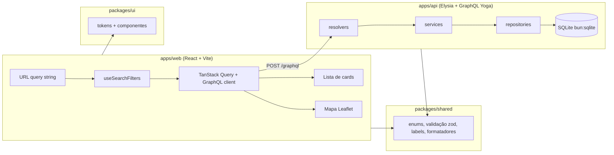

# Arquitetura

> System design do clone da busca de imóveis à venda. Leia junto com
> [business-rules.md](business-rules.md) (o *quê*) — este documento é o *como*.
> Itens marcados **(planejado)** ainda não existem no código; ao implementá-los, remova a marca
> e atualize o que tiver mudado.

## 1. Visão geral



| Pacote | Responsabilidade | Pode importar |
|---|---|---|
| `packages/shared` | Enums, tipos de domínio, schemas **zod** de validação, labels pt-BR, formatadores (`formatBRL`, plurais), geração de títulos, regras de badge. Código puro, sem I/O. | nada do monorepo |
| `packages/ui` | Design system: tokens (CSS variables) e componentes React sem conhecimento de rede. Componentes de domínio recebem dados prontos por props. | `shared` |
| `apps/api` | Servidor HTTP/GraphQL, acesso a dados, seed. | `shared` |
| `apps/web` | Páginas, roteamento, estado de URL, chamadas GraphQL, composição de componentes do `ui`. | `shared`, `ui` |

Regra: dependências só fluem nessa direção. `ui` nunca chama a API; `api` nunca importa `ui`/`web`.

## 2. Estrutura de pastas

Itens marcados ✅ já existem; o resto é planejado.

```
apps/
  api/
    src/
      index.ts                  # ✅ abre o banco, migra, sobe Elysia na porta 4000
      app.ts                    # ✅ createApp({ db, now }) — schema Yoga + rotas (usado nos testes)
      context.ts                # ✅ GraphQLContext por request (db, userId, now, loaders)
      graphql/                  # ✅ Etapa 3
        schema/*.graphql        # SDL — fonte da verdade do contrato
        generated/resolvers-types.ts  # gerado por `bun run codegen` (não editar)
        resolvers.ts            # registra os resolvers de cada módulo
        loaders.ts              # DataLoaders por request (bairro, fotos, comodidades, favoritos)
        scalars.ts              # DateTime
        errors.ts               # badUserInput(), parseOrThrow(schemaZod, args)
      modules/
        properties/             # ✅ Etapa 3
          properties.resolvers.ts   # finos: delegam ao serviço, montam campos derivados
          properties.service.ts     # regras: validação, origem de NEAREST, cursor, clusters
          properties.repository.ts  # só SQL: página keyset, COUNT, agregação do mapa, lotes
          property-where.ts     # ÚNICO lugar que traduz filtros → SQL
          sort.ts               # ordenações + encode/decode do cursor
          property-record.ts    # PropertyRecord (parent dos resolvers) + mapeamento da linha
          *.test.ts
        neighborhoods/          # ✅ record, repository (inclui busca por nome), resolvers
        locations/              # ✅ autocomplete: service + repository (ruas)
        health/                 # ✅
        favorites/              # ✅ addFavorite/removeFavorite/favoritesCount (x-user-id)
        photos/                 # ✅ GET /static/photos/{room}-{variant}.svg (placeholders)
      testing/test-app.ts       # ✅ banco em memória com 5.000 imóveis + gql() para testes
      bench/search-bench.ts     # ✅ `bun run bench` — tempos com o banco de 60k
      db/                       # ✅ Etapa 2
        client.ts               # openDatabase() — WAL, foreign_keys=ON; DB_PATH sobrescreve
        migrate.ts              # runMigrations() + CLI `bun run db:migrate`
        migrations/0001_init.sql …
        maintenance/recompute.ts  # medianas, aluguel estimado, relevância (CLI recompute-scores)
        seed/
          neighborhoods.ts      # 102 bairros reais (centro, R$/m², raio, perfil, metrô)
          generator.ts          # generateDataset() — função pura, determinística
          random.ts             # PRNG com seed fixa (mulberry32)
          texts.ts              # ruas e descrições
          insert.ts             # bulkInsert + withDeferredIndexes
          index.ts              # seedDatabase() + CLI `bun run seed`
    data/app.db                 # gerado; fora do git
  web/                        # ✅ Etapa 5
    codegen.ts                  # cliente GraphQL tipado (client preset, documentMode string)
    e2e/smoke.ts                # `bun run e2e`: fluxos no Chrome/Edge real (puppeteer-core)
    src/
      main.tsx                  # QueryClientProvider + RouterProvider + "@qa/ui/styles.css"
      router.tsx                # rotas (§8)
      graphql/operations.ts     # TODAS as operações (graphql`…`); generated/ = codegen
      lib/                      # graphql-client (erros com field), user-id, query-client, hooks,
                                #   navigation (última busca para o "Voltar")
      styles/map-markers.css    # posição dos marcadores do Leaflet (busca e detalhe)
      features/
        layout/                 # SiteHeader (AppHeader + router), NotFoundPage
        search/                 # SearchPage = SearchLayout + SearchFilters + ResultsList + SearchMap
          use-search-state.ts   # estado da busca = URL (parse/serialize de @qa/shared)
          queries.ts            # hooks TanStack Query (lista infinita, contagem, mapa, bairros…)
          LocationSearch.tsx    # autocomplete (Combobox) → bairro / rua / código / cidade
          SearchFilters.tsx     # FilterBar + Popovers + Drawer(FilterPanel) com rascunho
          ResultsList.tsx       # ResultsHeader + SortMenu + cards + "Ver mais" + estados
          SearchMap.tsx         # Leaflet + clusters + sincronia com URL/lista
          map-utils.ts, search-page.css (só layout, só tokens)
        favorites/use-favorites.ts # useToggleFavorite (otimista em todos os caches), useFavoritesCount
        property/               # ✅ PropertyPage (galeria, preços, características, itens, mapa),
                                #    PropertyLocationMap, queries (usePropertyDetail)
packages/
  shared/src/
    domain/                     # ✅ property.ts (enums/labels), amenities.ts (catálogo +
                                #    aplicabilidade), limits.ts (faixas, limites de SP),
                                #    derived.ts (aluguel estimado, retorno, badges, relevância)
                                #    search.ts (ordenações, publicação, página, limites),
                                #    map-grid.ts (cellSizeForZoom, cellOf, clusterId)
    validation/                 # ✅ property.ts (propertyInputSchema), search.ts
                                #    (searchFiltersSchema, searchArgsSchema, mapClustersArgsSchema,
                                #    locationSuggestionsArgsSchema)
    format/                     # ✅ text.ts (normalizeText, slugify, formatCep),
                                #    property-text.ts (formatBRL, formatArea, pluralize,
                                #    propertyTitle, propertyHeadline); datas relativas depois
    search/                     # ✅ state.ts (SearchState, PropertyFilters, toApiFilters),
                                #    url.ts (parseSearchState/serializeSearchState — contrato §8),
                                #    describe.ts (cabeçalho, chips ativos, rótulos dos filtros),
                                #    validate.ts (validatePropertyFilters)
  ui/src/
    tokens/                     # ✅ tokens.ts (fonte) → tokens.css (gerado)
    components/                 # ✅ base: Button, Chip, Input, Combobox, Popover, Drawer…
    domain/                     # ✅ PropertyCard, FilterBar, FilterPanel, SearchLayout, SortMenu…
    **/*.stories.tsx
docs/
```

## 3. Fluxo de uma busca (ponta a ponta)

1. **URL** `/comprar/imovel/pinheiros?tipos=apartamento&quartos=3&ordem=menor-valor`
   (contrato completo no §8).
2. `useSearchState()` (web) faz `parseSearchState()` de `@qa/shared` → `SearchState`
   (`neighborhoodSlugs`, `mapArea`, `filters: PropertyFilters`, `sort`). Mudar algo chama
   `setState` → `searchStateToUrl()` + `navigate` (push para ações do usuário; replace para
   movimentos do mapa). `toApiFilters(state, "list" | "map")` monta os filtros da API.
3. Duas queries TanStack Query em paralelo, com `queryKey` derivada dos filtros:
   - `searchProperties` (lista + `totalCount`, `useInfiniteQuery` com o cursor);
   - `propertyMapClusters` (área visível + 20% de margem, zoom atual, filtros sem bairro).
   Filtros rápidos e "Mais filtros" editam um **rascunho**; o botão "Ver N imóveis" usa
   `searchProperties(first: 0) { totalCount }` do rascunho (debounce 300 ms) e só "Ver" aplica.
4. **Resolver** recebe os args já tipados pelo schema GraphQL e repassa ao serviço.
5. **Service** valida com o schema zod de `shared` (`searchArgsSchema`) — faixas, min≤max,
   bbox, tamanho de página — via `parseOrThrow`, que converte falhas em `BAD_USER_INPUT` com
   `extensions.field`. Confere no banco o que o zod não sabe (bairros existem; `onlyFavorites`
   exige `x-user-id`). Aplica defaults (`sort = RELEVANCE`, `first = 24`) e define a origem de
   `NEAREST`.
6. **Repository** monta SQL com `buildPropertyWhere(filters)` → `{ sql, params }` (o mesmo
   WHERE é usado pela lista, pela contagem e pelos clusters) e executa statements preparados
   e cacheados do `bun:sqlite`.
7. Campos relacionados (fotos, bairro, `isFavorite`) são resolvidos em lote por loaders
   por request (padrão DataLoader) — nunca N+1.
8. Resposta volta como `PropertyConnection`; o web renderiza `PropertyCard`s do `ui`.

## 4. Schema GraphQL

**Schema-first:** o SDL em `apps/api/src/graphql/schema/*.graphql` é a fonte da verdade (não
copie o schema para os docs — leia os arquivos). Após alterá-lo, rode `bun run codegen`, que
gera `apps/api/src/graphql/generated/resolvers-types.ts` (tipos `Resolvers`, args e enums como
uniões de string, compatíveis com os tipos de `shared`). O arquivo gerado é commitado e nunca
editado à mão. O web ganha codegen próprio na Etapa 5.

| Arquivo | Conteúdo |
|---|---|
| `common.graphql` | `scalar DateTime` (ISO-8601; internamente epoch ms), `LatLng`, `Bounds`, inputs `IntRange`, `BoundingBox`, `LatLngInput` |
| `health.graphql` | `type Query { health }` — a raiz `Query`; os outros arquivos usam `extend type Query` |
| `property.graphql` | enums (`PropertyType`, `SortOrder`, `PublishedWithin`, `PropertyBadge`, `AmenityCode`…), `PropertySearchFilters`, `Property`, `PropertyConnection`; queries `searchProperties`, `property(id)`, `amenities` |
| `map.graphql` | `MapCluster`, `MapClusterResult { clusters totalCount zoom }`; query `propertyMapClusters` |
| `neighborhood.graphql` | `Zone`, `Neighborhood`; query `neighborhoods` |
| `location.graphql` | `LocationSuggestion` (NEIGHBORHOOD / STREET / PROPERTY_CODE); query `locationSuggestions` |

Operações disponíveis hoje:

```graphql
searchProperties(filters, sort = RELEVANCE, origin, first = 24, after): PropertyConnection!
propertyMapClusters(filters, bbox!, zoom!): MapClusterResult!
property(id!): Property            # null se não existir ou não estiver ACTIVE
locationSuggestions(query!, limit = 8): [LocationSuggestion!]!
neighborhoods: [Neighborhood!]!
amenities: [Amenity!]!
health: Health!
```

**Favoritos** (`favorite.graphql`): `addFavorite(propertyId)` / `removeFavorite(propertyId)`
(idempotentes, exigem `x-user-id`; favoritar exige imóvel `ACTIVE` → senão `NOT_FOUND`) e
`favoritesCount`. O filtro `onlyFavorites` e o campo `Property.isFavorite` leem a mesma tabela.

Mapeamento resolver → "parent" (configurado em `apps/api/codegen.ts`): `Property` recebe
`PropertyRecord`, `Neighborhood` recebe `NeighborhoodRecord`, `PropertyConnection` recebe
`PropertyConnectionModel` (com `countTotal()` — o `COUNT(*)` só roda se `totalCount` for pedido).
Campos que não estão no record (`title`, `headline`, `badges`, `amenities`, `photos`,
`neighborhood`, `isFavorite`…) têm resolver próprio em `properties.resolvers.ts`.

Convenções do schema:
- Nomes em inglês, camelCase; enums UPPER_SNAKE; labels pt-BR vêm de `shared`, não do schema
  (exceto `Amenity.label` e `LocationSuggestion.label`, por conveniência). Todo campo novo tem
  descrição (`"..."`) no SDL.
- Mutations futuras seguem `verbNoun(input: VerbNounInput!): VerbNounPayload!` (ex.:
  `createProperty(input: CreatePropertyInput!)`). As de favoritos serão exceção histórica.
- **Erros** (`apps/api/src/graphql/errors.ts`): `GraphQLError` com mensagem em pt-BR e
  `extensions.code` ∈ `BAD_USER_INPUT` | `NOT_FOUND` | `INTERNAL`. Erros de entrada trazem
  `extensions.field` (caminho do argumento, ex.: `"filters.price"`) e `extensions.issues`
  (lista `{ field, message }`). Validação de entrada sempre via `parseOrThrow(schemaZod, args)`.
- Identidade: header `x-user-id` (UUID anônimo do navegador) lido em `context.ts`.
- Contexto de cada request (`GraphQLContext`): `db`, `userId`, `now` (relógio fixo durante a
  request; os testes injetam um instante fixo) e `loaders` (DataLoader: bairro, fotos,
  comodidades e favoritos por id — nunca faça uma query por imóvel num resolver).

## 5. Modelo de dados (SQLite)

Configuração: `PRAGMA journal_mode = WAL; foreign_keys = ON; synchronous = NORMAL`.
Timestamps em **INTEGER (epoch ms, UTC)**; booleanos em INTEGER 0/1; dinheiro em INTEGER reais.
Migrações são arquivos SQL numerados em `apps/api/src/db/migrations`, aplicados em ordem e
registrados em `schema_migrations`.

```sql
CREATE TABLE neighborhoods (
  id INTEGER PRIMARY KEY,
  slug TEXT NOT NULL UNIQUE,
  name TEXT NOT NULL,
  name_normalized TEXT NOT NULL,          -- minúsculo, sem acento (autocomplete)
  zone TEXT NOT NULL,
  center_lat REAL NOT NULL, center_lng REAL NOT NULL,
  north REAL NOT NULL, south REAL NOT NULL, east REAL NOT NULL, west REAL NOT NULL,
  median_price_per_m2 INTEGER NOT NULL DEFAULT 0,
  median_rent_per_m2 INTEGER NOT NULL
);

CREATE TABLE properties (
  id INTEGER PRIMARY KEY,                 -- começa em 1000000
  status TEXT NOT NULL CHECK (status IN ('DRAFT','ACTIVE','INACTIVE')),
  type TEXT NOT NULL CHECK (type IN ('APARTMENT','HOUSE','CONDO_HOUSE','STUDIO')),
  cep TEXT NOT NULL,
  street TEXT NOT NULL,
  street_normalized TEXT NOT NULL,
  number TEXT NOT NULL,
  complement TEXT,
  neighborhood_id INTEGER NOT NULL REFERENCES neighborhoods(id),
  lat REAL NOT NULL, lng REAL NOT NULL,
  sale_price INTEGER NOT NULL,
  previous_price INTEGER,
  condo_fee INTEGER NOT NULL,
  iptu INTEGER NOT NULL,
  monthly_cost INTEGER GENERATED ALWAYS AS (condo_fee + iptu) STORED,
  price_per_m2 INTEGER GENERATED ALWAYS AS (sale_price / area) STORED,
  area INTEGER NOT NULL,
  bedrooms INTEGER NOT NULL, suites INTEGER NOT NULL,
  bathrooms INTEGER NOT NULL, parking_spaces INTEGER NOT NULL,
  floor INTEGER,
  is_furnished INTEGER NOT NULL DEFAULT 0,
  accepts_pets INTEGER NOT NULL DEFAULT 0,
  near_subway INTEGER NOT NULL DEFAULT 0,
  is_exclusive INTEGER NOT NULL DEFAULT 0,
  is_rented INTEGER NOT NULL DEFAULT 0,
  monthly_rent INTEGER,                   -- aluguel atual, só se is_rented
  estimated_rent INTEGER NOT NULL,        -- calculado pelo serviço (business-rules §2.1)
  rental_yield REAL GENERATED ALWAYS AS (CAST(estimated_rent AS REAL) / sale_price) STORED,
  description TEXT NOT NULL,
  photo_count INTEGER NOT NULL DEFAULT 0, -- desnormalizado (card e score)
  relevance_score REAL NOT NULL DEFAULT 0,
  published_at INTEGER,
  created_at INTEGER NOT NULL,
  updated_at INTEGER NOT NULL
);

CREATE TABLE property_photos (
  property_id INTEGER NOT NULL REFERENCES properties(id) ON DELETE CASCADE,
  position INTEGER NOT NULL,
  url TEXT NOT NULL,
  PRIMARY KEY (property_id, position)
) WITHOUT ROWID;

CREATE TABLE property_amenities (
  property_id INTEGER NOT NULL REFERENCES properties(id) ON DELETE CASCADE,
  amenity_code TEXT NOT NULL,
  PRIMARY KEY (property_id, amenity_code)
) WITHOUT ROWID;

CREATE TABLE favorites (
  user_id TEXT NOT NULL,
  property_id INTEGER NOT NULL REFERENCES properties(id) ON DELETE CASCADE,
  created_at INTEGER NOT NULL,
  PRIMARY KEY (user_id, property_id)
) WITHOUT ROWID;
```

Validações de faixa ficam em `shared` (zod), não em `CHECK` — o banco só garante enums e
integridade referencial. Comodidades são texto (código do enum) para manter o banco legível e
dispensar tabela de catálogo; o catálogo vive em `shared/domain/amenities.ts`.

### 5.1 Índices

```sql
-- ordenações (keyset): status primeiro porque toda busca filtra ACTIVE
CREATE INDEX idx_prop_relevance ON properties(status, relevance_score DESC, id DESC);
CREATE INDEX idx_prop_newest    ON properties(status, published_at DESC, id DESC);
CREATE INDEX idx_prop_price     ON properties(status, sale_price, id);
CREATE INDEX idx_prop_yield     ON properties(status, rental_yield DESC, id DESC);
-- NEAREST não tem índice: a distância é calculada sobre o conjunto já filtrado (ver §6)
-- localização
CREATE INDEX idx_prop_geo       ON properties(status, lat, lng);
CREATE INDEX idx_prop_neigh     ON properties(neighborhood_id, status);
-- comodidades (filtro E) e autocomplete
CREATE INDEX idx_amenity_code   ON property_amenities(amenity_code, property_id);
CREATE INDEX idx_prop_street    ON properties(street_normalized);
CREATE INDEX idx_neigh_name     ON neighborhoods(name_normalized);
CREATE INDEX idx_fav_user       ON favorites(user_id, created_at DESC);
```

Filtros de baixa seletividade (quartos, vagas, booleanos) **não** ganham índice próprio: são
avaliados sobre o conjunto já reduzido por status/bairro/bbox/ordenação. Com ~60k linhas o
planner do SQLite resolve qualquer combinação em poucos ms; meça com `EXPLAIN QUERY PLAN`
antes de adicionar índices. Meta: **p95 < 50 ms** por query no servidor local.

### 5.2 Tradução de filtros → SQL (`property-where.ts`)

- Sempre `p.status = 'ACTIVE'`.
- Faixas: `p.sale_price >= ?`/`<= ?`, idem `monthly_cost`, `area`.
- Mínimos: `p.bedrooms >= ?` etc.
- `types`: `p.type IN (?, …)`; `neighborhoodSlugs`: `p.neighborhood_id IN (SELECT id FROM neighborhoods WHERE slug IN (…))`.
- `bbox`: `p.lat BETWEEN ? AND ? AND p.lng BETWEEN ? AND ?`.
- `amenities` (E): interseção dos ids de cada comodidade —
  `p.id IN (SELECT property_id FROM property_amenities WHERE amenity_code = ? INTERSECT SELECT … = ?)`.
  Medido ~2,5× mais rápido que `GROUP BY … HAVING COUNT(*) = n` (e `EXISTS` por comodidade é
  rápido na lista, mas lento no `COUNT`).
- `onlyFavorites`: `p.id IN (SELECT property_id FROM favorites WHERE user_id = ?)`.
- `publishedWithin`: `p.published_at >= ?` (instante calculado em `shared`).

Nenhum outro arquivo escreve cláusulas de filtro. Feature nova que filtra imóveis estende
este builder e seus testes.

### 5.3 Seed (`apps/api/src/db/seed`)

Pipeline de `bun run seed` (padrão: 60.000 imóveis, seed `42`; opções `--count` e `--seed`
rodando `bun src/db/seed/index.ts` dentro de `apps/api`):

1. Apaga o arquivo do banco e roda as migrações.
2. `generateDataset({ count, seed, now })` — **função pura e determinística** (mesma seed ⇒
   mesmos dados; só as datas acompanham o `now`). Para cada imóvel sorteia um bairro (peso por
   bairro), tipo (pelo perfil do bairro), quartos/suítes/banheiros/vagas/área coerentes entre
   si, localização gaussiana ao redor do centro do bairro, preço = R$/m² do bairro × fator do
   tipo × fator de tamanho × ruído log-normal (±18%), condomínio por m² crescente com o padrão
   do bairro, IPTU ≈ 0,025–0,045% do preço ao mês, comodidades por probabilidade (respeitando
   a aplicabilidade por tipo), fotos e descrição.
3. **Cada imóvel é validado com `propertyInputSchema` de `packages/shared`** — o mesmo schema
   que o cadastro usará. Um imóvel inválido aborta o seed.
4. `withDeferredIndexes`: remove os índices `idx_*`, grava tudo numa transação com
   `INSERT` multi-linha (`bulkInsert`), roda `recomputeDerivedFields` e recria os índices.
   Criar o índice uma vez no fim é ~3× mais rápido que mantê-lo linha a linha.
5. `ANALYZE` para o planner do SQLite.

Resultado de referência (notebook Windows): 60.000 imóveis, 102 bairros, ~1,1 mi de fotos e
~850 mil comodidades em **~9–10 s**; banco com ~130 MB.

`recomputeDerivedFields(db, now)` (`db/maintenance/recompute.ts`) recalcula
`median_price_per_m2` dos bairros, `estimated_rent` e `relevance_score` de todos os imóveis,
usando as funções de `shared` (`computeEstimatedRent`, `computeBadges`,
`computeRelevanceScore`). Uma feature que cria/edita imóveis deve chamá-lo (ou uma versão
restrita ao bairro afetado) após gravar.

**Fotos:** a URL `/static/photos/{room}-{variant}.svg` (`room` ∈ living, bedroom, kitchen,
bathroom, facade, balcony; `variant` 1–8) é desenhada pela api em
`modules/photos/placeholder-photo.ts` — sem arquivos e sem serviços externos. O Vite repassa
`/static` para a api. Um cadastro real gravaria URLs de uploads no mesmo campo.

### 5.4 Desempenho

`openDatabase()` configura `cache_size = 64 MB` e `mmap_size = 512 MB`. Com o cache padrão do
SQLite (2 MB, menor que a tabela de imóveis) as buscas por bairro e por área do mapa levavam
~270–330 ms; com o cache maior, ~30–40 ms.

`bun run bench` (`apps/api/src/bench/search-bench.ts`) mede a API completa (HTTP → GraphQL →
serviço → SQL → loaders) com o banco do seed. Referência (60.000 imóveis, notebook Windows,
30 execuções, resposta com 24 cards + `totalCount`):

| Cenário | p50 | p95 |
|---|---|---|
| Lista padrão (cidade toda, relevância) | 5 ms | 7 ms |
| Bairro + 3+ quartos, menor valor | 30 ms | 32 ms |
| Área do mapa + tipo + faixa de preço | 41 ms | 50 ms |
| Comodidades (3) + 2+ vagas | 26 ms | 45 ms |
| Mais próximos (cidade toda) | 34 ms | 52 ms |
| Maior retorno + publicados em 30 dias | 3 ms | 5 ms |
| Página 11 via cursor | 5 ms | 5 ms |
| Só contagem com 5 filtros ("Ver N imóveis") | 15 ms | 16 ms |
| Mapa: cidade toda, zoom 11 (58 mil pontos agregados) | 49 ms | 69 ms |
| Mapa: zona oeste, zoom 15, com filtros | 38 ms | 50 ms |
| Detalhe do imóvel | 1 ms | 1 ms |
| Autocomplete de bairro / de rua | 0,3 ms / 9 ms | 0,5 ms / 11 ms |

O caso mais pesado é o mapa da cidade inteira sem filtros (agrega todos os imóveis ativos).
Se um dia precisar de mais velocidade: tabela R*Tree para a área do mapa (o SQLite do Bun tem
`ENABLE_RTREE`) ou clusters pré-calculados por zoom.

## 6. Paginação

**Keyset (cursor)**, não offset: estável quando dados mudam e com custo constante em
páginas profundas.

- Ordem efetiva = coluna da ordenação + `id` no mesmo sentido (`relevance_score DESC, id DESC`;
  `sale_price ASC, id ASC`…).
- `endCursor` = base64url de `JSON.stringify([sort, valorDaOrdenação, id, origem | null])`
  (`sort.ts`). Um cursor de outra ordenação ou malformado é rejeitado (`BAD_USER_INPUT`,
  field `after`). Em `NEAREST` a origem viaja no cursor para a página seguinte usar a mesma.
- Próxima página: `WHERE … AND (col, id) < (?, ?)` (desc) ou `>` (asc) — row values do
  SQLite — `LIMIT first + 1`; o item extra define `hasNextPage`.
- `NEAREST`: a "coluna" é a expressão de distância
  `(lat - :olat)*(lat - :olat) + ((lng - :olng)*:coslat)*((lng - :olng)*:coslat)`, usada no
  `ORDER BY` e no keyset; a origem entra no cursor para que a página seguinte use a mesma.
  Custo aceitável porque roda sobre o conjunto filtrado (bairro/bbox); medir na Etapa 3.
- `totalCount` é um `SELECT COUNT(*)` separado com o mesmo WHERE, só executado quando o campo
  é pedido.
- No web, `useInfiniteQuery`; botão "Ver mais" chama `fetchNextPage`. Mudar filtro/ordem
  reinicia a lista.

## 7. Mapa

Leaflet + tiles OpenStreetMap (`https://tile.openstreetmap.org/{z}/{x}/{y}.png`, com
atribuição). Centro padrão: Praça da Sé (-23.5505, -46.6333), zoom 12.

### 7.1 Clusters no servidor (agregação em grade)
Equivalente ao supercluster, mas feito em SQL para respeitar todos os filtros sem trafegar
milhares de pontos:

1. O web envia `bbox` visível (com 20% de margem) + `zoom` + os mesmos filtros da lista.
2. Tamanho da célula: `cell = 360 / (2^zoom × CELLS_PER_TILE)` graus, com `CELLS_PER_TILE = 2`
   (≈ 128 px na tela — com 64 px o mapa ficava poluído, bem mais denso que o original).
   A grade é ancorada em (-90, -180), então as células não "pulam" quando o mapa é arrastado.
3. ```sql
   SELECT CAST((lat + 90) / :cell AS INT) AS row, CAST((lng + 180) / :cell AS INT) AS col,
          COUNT(*) AS count, AVG(lat), AVG(lng), MIN(lat), MAX(lat), MIN(lng), MAX(lng),
          MIN(id) AS any_id
   FROM properties p WHERE <buildPropertyWhere(filters ∪ bbox)>
   GROUP BY row, col
   ```
4. `count = 1` → `propertyId = any_id`.
5. Resultado limitado a 1.000 células (`MAX_MAP_CELLS`). Se passar, o serviço junta as células
   em blocos 2×2 em memória (`mergeCellsToParentZoom`) — a célula do zoom z−1 tem o dobro do
   tamanho e a mesma origem, então linha/coluna viram `floor(n / 2)` e o resultado é idêntico
   a agregar direto (há teste). `MapClusterResult.zoom` informa o zoom efetivamente usado.
6. Os clusters usam exatamente os mesmos filtros da lista: a soma dos `count` é igual ao
   `totalCount` de `searchProperties` com a mesma `bbox` (há teste). Um `filters.bbox` é ignorado
   — vale o argumento `bbox`.

### 7.2 Comportamento no cliente (`apps/web/src/features/search/SearchMap.tsx`)
- Leaflet "puro" (sem react-leaflet), criado uma vez; marcadores são `L.divIcon` com o HTML de
  `<MapCluster interactive={false} />` (bolha branca com o número, como no original). O marcador
  do Leaflet é o elemento focável (Enter = clique) e recebe `aria-label` de `mapClusterLabel`.
  Pino vermelho (`MapPin`) no centro do bairro quando há exatamente um no contexto.
- Clique em cluster com `count > 1` → aproxima (`fitBounds` nos limites do cluster); com
  `count = 1` → prévia do imóvel (`PropertyCard` sobre o mapa, query `property(id)`).
- Hover num card da lista destaca o cluster que o contém: o web calcula o id da célula com
  `cellOf`/`clusterId` de `@qa/shared` (mesma grade do servidor) e troca só aquele ícone.
- **Bairro × área do mapa** (regra em business-rules §4.1):
  - Escolher um bairro no autocomplete grava o bairro na URL e **remove** `area-mapa`; o mapa
    enquadra os limites do bairro. Escolher uma **rua** grava o bairro da rua + `area-mapa` em
    volta da rua. "Toda a cidade de São Paulo" limpa bairro e área.
  - Movimento **do usuário** (arrastar, zoom, clique em cluster), com debounce de 400 ms, grava
    `area-mapa` + `zoom` na URL (replace) **mantendo** o bairro.
  - Movimentos **programáticos** (enquadrar bairro, voltar no histórico, `invalidateSize` ao
    redimensionar) rodam dentro de `moveProgrammatically()`: sem animação, o `moveend` é
    síncrono e um flag impede que ele vire busca. Sem isso, cada enquadramento gravaria uma área.
  - URL → mapa: quando `area-mapa`/bairros mudam, o mapa se reposiciona — exceto se a área da
    URL já é a que ele mostra (foi ele quem gravou).
  - Mapa escondido (mobile em "Lista") tem tamanho 0: não calcula área nem enquadra; ao
    aparecer, sincroniza com a URL. A coluna do mapa tem `isolation: isolate` para os z-index
    do Leaflet não cobrirem o resto da página.
  - Toggle **"Buscar ao mover o mapa"** (ligado por padrão, preferência salva no navegador):
    desligado, mover só atualiza os clusters e mostra "Buscar nesta área".
- Chips dos filtros ativos (`activeFilterChips` de `@qa/shared`) no topo do mapa, removíveis
  com × (`removeActiveFilter`).
- **(planejado, opcional)** "Desenhar área de busca": polígono enviado como lista de pontos;
  o servidor filtra por bbox do polígono no SQL e refina com point-in-polygon em memória.

## 8. Contrato da URL

Rotas:
- `/comprar/imovel` — busca em toda a cidade.
- `/comprar/imovel/:bairroSlug` — busca num bairro (atalho SEO; equivale a `bairros=slug`).
- `/` → redireciona para `/comprar/imovel`.
- `/imovel/:id` — detalhe do imóvel. O card navega na mesma aba (com `state.fromSearch`), então o
  "voltar" do navegador volta à busca com os filtros.
- `/favoritos` → redireciona para `/comprar/imovel?favoritos=sim`.
- Qualquer outra rota → página "não encontrada".

Query string (nomes em pt-BR, valores legíveis; ausente = "Tanto faz"):

| Param | Exemplo | Filtro |
|---|---|---|
| `bairros` | `pinheiros,vila-madalena` | `neighborhoodSlugs` |
| `area-mapa` | `-23.55,-46.70,-23.58,-46.66` (N,W,S,E) | `bbox` |
| `zoom` | `14` | estado do mapa |
| `tipos` | `apartamento,casa-condominio` | `types` (slugs: `apartamento`, `casa`, `casa-condominio`, `studio`) |
| `preco-min` / `preco-max` | `500000` | `price` |
| `condo-iptu-min` / `condo-iptu-max` | `2000` | `monthlyCost` |
| `area-min` / `area-max` | `60` | `area` |
| `quartos` | `3` | `minBedrooms` |
| `banheiros` | `2` | `minBathrooms` |
| `suites` | `1` | `minSuites` |
| `vagas` | `1` | `minParkingSpaces` |
| `publicado` | `7d` (`hoje`,`7d`,`15d`,`30d`,`2m`,`6m`) | `publishedWithin` |
| `mobiliado` / `metro` / `exclusivo` / `alugado` | `sim` \| `nao` | booleanos |
| `itens` | `pool,gym,air-conditioning` (código do `AmenityCode` em kebab-case) | `amenities` |
| `favoritos` | `sim` | `onlyFavorites` (lista e mapa) |
| `ordem` | `proximos`, `relevancia`, `recentes`, `menor-valor`, `maior-valor`, `maior-retorno` | `sort` |

Sobre o formato: o original usa segmentos de path com tokens (`/q-ate-400000`); optamos por
query string legível porque é trivial de serializar, testar e estender. Como parse e
serialização ficam isolados em `url.ts`, migrar para o formato do original depois não afeta
o resto do código.

Parse e serialização ficam **só** em `packages/shared/search/url.ts`, com teste de ida e volta.
Valores inválidos na URL são descartados silenciosamente (a página nunca quebra por URL ruim).

## 9. Frontend (`apps/web`)

- **Rotas:** React Router 8 (`createBrowserRouter`). **Dados:** TanStack Query + `graphqlRequest`
  (`lib/graphql-client.ts`), que recebe as operações tipadas geradas pelo codegen
  (`src/graphql/operations.ts` → `bun run codegen`) e lança `GraphQLRequestError` com
  `code`/`field`. Erros `BAD_USER_INPUT` não são repetidos automaticamente.
- **Estado:** a busca inteira vive na URL (`useSearchState`). Fora dela só há estado de tela
  (hover, Lista/Mapa no mobile, rascunho dos filtros, preferência "Buscar ao mover o mapa").
- **Layout:** `SearchLayout` do `ui` — header → `FilterBar` → lista rolável (grade
  `auto-fill, minmax(240px, 1fr)`, 3 colunas em ~1440 px) | mapa (40%). CSS no web é **só de
  layout/posicionamento** e **só com tokens** (`search-page.css`); nada de componente visual.
- **Alvo principal: desktop/notebook** (≥ 1280 px; testar também 1366×768). **Mobile (< 768 px):**
  uma coluna, botão flutuante "Lista | Mapa", chips com rolagem, "Mais filtros" em tela cheia.
- **Estados obrigatórios** em toda tela com dados: carregando (`PropertyCardSkeleton`,
  skeleton no cabeçalho, spinner no mapa), vazio (`StatusMessage` + "Limpar filtros"), erro
  (`StatusMessage tone="error"` + "Tentar novamente").
- **Lista:** 24 por página; "Ver mais" busca a próxima com o cursor; nova busca volta ao topo.
  O card navega na mesma aba (Ctrl/Cmd+clique abre em nova aba). A posição de rolagem é salva
  por URL (sessionStorage) e restaurada ao voltar do detalhe.
- **Detalhe → "Voltar para a busca":** se veio da busca (`location.state.fromSearch`), volta no
  histórico (filtros, páginas carregadas e rolagem preservados); senão, vai para a última busca
  (`lib/navigation.ts`) ou para o bairro do imóvel.
- **Favoritos:** `userId` UUID gerado e salvo em `localStorage` (`lib/user-id.ts`), enviado em
  `x-user-id` em toda request. `useToggleFavorite()` atualiza na hora (otimista) a lista, a
  prévia do mapa, o detalhe e o contador do cabeçalho; desfaz se a API falhar e recarrega as
  buscas "só favoritos". "Ver favoritos" = `?favoritos=sim` (chip na barra e link no cabeçalho).
- **Desempenho da tela:** cards memorizados (`PropertyCard` e `ResultCard` com callbacks
  estáveis) — o hover só redesenha os cards afetados; o mapa troca só o ícone destacado; páginas
  carregadas sob demanda (`React.lazy`): quem abre um imóvel não baixa a busca, e vice-versa.
- **Fotos:** URLs relativas servidas pela API em `/static/photos/…` (§5.3); o Vite faz proxy
  de `/graphql` e `/static`.
- **Teste de ponta a ponta:** `bun run e2e` (com `bun run dev` rodando) abre o Chrome/Edge
  instalado sem janela e percorre 20 fluxos (busca, filtros rápidos e painel, ordenação,
  "Ver mais", voltar, chips do mapa, mover o mapa, autocomplete, vazio, erro, URL inválida,
  favoritar, ver favoritos, detalhe com galeria, voltar mantendo filtros, desfavoritar,
  imóvel inexistente, mobile). Prints em `apps/web/e2e/screenshots/` (fora do git).

## 10. Design system

`packages/ui` expõe tokens como CSS custom properties (`--qa-color-primary`, …) gerados a partir
de `tokens.ts` (fonte única), componentes base (`components/`) e de domínio (`domain/`), cada um
com `.tsx` + `.css` (BEM `qa-`, só tokens) + `.stories.tsx`. CSS global (fonte Inter local via
`@fontsource-variable/inter`, tokens, base) em `@qa/ui/styles.css`. Sem CSS-in-JS e sem
dependência de UI externa. Detalhes, catálogo e receita em
[design-system.md](design-system.md).

Validação: `stories.test.tsx` renderiza todas as stories com `react-dom/server` e checa
acessibilidade básica via `HTMLRewriter` (Bun); `tokens.test.ts` garante `tokens.css` em dia e
nenhum `var(--qa-…)` inexistente; o Storybook roda o addon a11y (axe).

## 11. Convenções de código

- **TypeScript strict** em tudo; proibido `any` (use `unknown` + narrowing).
- **Idioma:** identificadores, nomes de arquivos e commits em inglês; textos de UI, mensagens
  de erro para o usuário e documentação em português.
- **Arquivos:** kebab-case (`property-where.ts`); componentes React em PascalCase
  (`PropertyCard.tsx`) com story ao lado (`PropertyCard.stories.tsx`).
- **Exports nomeados**; sem `export default` (exceto onde a ferramenta exige, ex. stories).
- **Camadas na API:** resolver (fino, sem regra) → service (validação e regra de negócio) →
  repository (só SQL). Repository nunca valida; resolver nunca toca no banco.
- **SQL:** sempre parametrizado (`?`/`$nome`), nunca concatenação de valores do usuário.
- **Regra de negócio nova** → `packages/shared` + teste + atualização de
  `docs/business-rules.md`, no mesmo commit.
- **Lint/format:** Biome. **Testes:** `bun test`, arquivos `*.test.ts(x)` ao lado do código.
  Repository/serviço testados contra um SQLite em memória com seed pequeno determinístico.
- **Commits:** Conventional Commits (`feat:`, `fix:`, `docs:`, `test:`, `chore:`).
- **Multiplataforma (Windows, Linux, macOS):** só Bun é pré-requisito (Node não é exigido).
  Scripts de `package.json` não usam sintaxe de shell específica (`rm -rf`, `VAR=x cmd`,
  `&`); tarefas não triviais viram scripts TypeScript executados com `bun`. Caminhos com
  `path.join`/`import.meta.dir`, nunca `/` ou `\` literais. `.gitattributes` força `eol=lf`.

## 12. Decisões registradas

| Decisão | Motivo |
|---|---|
| SQLite (`bun:sqlite`) em vez de Postgres | Zero infraestrutura; 60k linhas cabem com folga; leitura muito rápida. |
| SQL manual em vez de ORM | Controle sobre índices/keyset/agrupamento; o builder único de WHERE evita duplicação. |
| Clusters por grade em SQL em vez de supercluster | Respeita todos os filtros sem enviar 60k pontos ao cliente nem reindexar por request. |
| Keyset em vez de offset | Custo constante e sem itens repetidos/pulados com "Ver mais". |
| Schema-first + codegen | O SDL é contrato único e tipado para api e web; agentes leem um só lugar. |
| zod em `shared` | A mesma validação roda no formulário (web) e no serviço (api). |
| Usuário anônimo por header | Favoritos sem implementar autenticação, fora do escopo. |
| `graphql@16` e `graphql-yoga@3.9.1` fixados na api | O plugin `@elysiajs/graphql-yoga` traz o Yoga 3.9.1, que só aceita `graphql` 15/16. A api depende de `graphql-yoga` **na mesma versão exata** só para montar o schema tipado (`createSchema<GraphQLContext>`) e entregá-lo ao plugin. Duas versões de `graphql`/Yoga instaladas quebram o schema ("from another module"): ao atualizar, confira que `bun.lock` tem uma única entrada de cada. |
| Resolvers tipados por codegen | `typescript-resolvers` gera `Resolvers` a partir do SDL, com mappers para os records. O tipo de `resolvers` do plugin (via graphql-mobius) não aceita esses tipos, por isso o schema é montado fora do plugin. |
| Cache do SQLite 64 MB + mmap | Medido: buscas por bairro/área do mapa caíram de ~300 ms para ~35 ms (§5.4). |
| Código-fonte TS exportado direto por `ui`/`shared` | Sem etapa de build entre pacotes; Bun e Vite leem `.ts` direto. |
| Biome no lugar de ESLint + Prettier | Uma ferramenta só, rápida, sem plugins. |
| Leaflet sem react-leaflet | Controle total de movimentos programáticos × do usuário (o ponto mais delicado da sincronia mapa ⇄ URL). |
| Codegen do web com `documentMode: "string"` | Operações tipadas sem precisar do runtime `graphql` no navegador. |
| `dev` da api roda a partir da raiz (`cd ../.. && bun --watch apps/api/src/index.ts`) | De dentro de `apps/api` o `bun --watch` não observa `packages/shared`: mudar uma regra exigiria reiniciar a api na mão. |
| E2E com `puppeteer-core` + navegador instalado | Sem baixar navegador; roda no Windows/macOS/Linux com Chrome ou Edge. |
